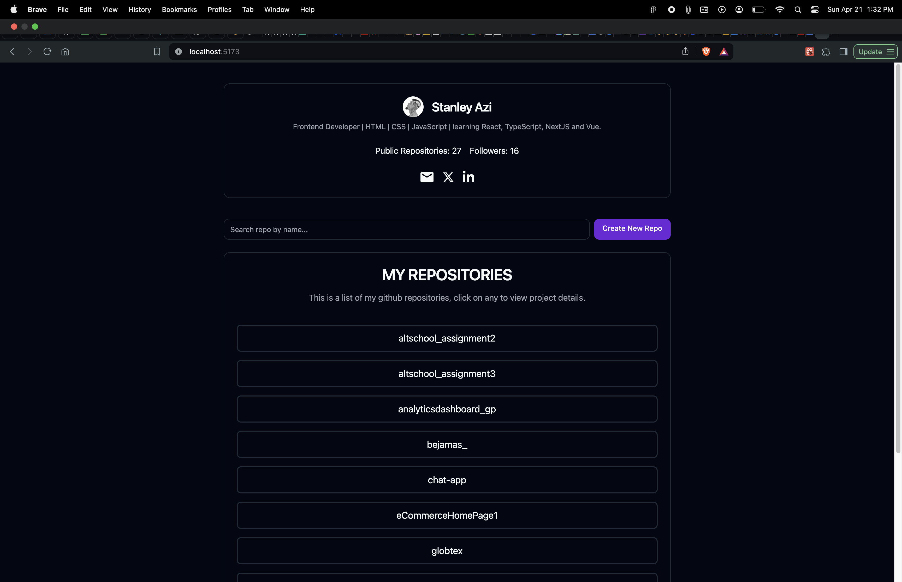
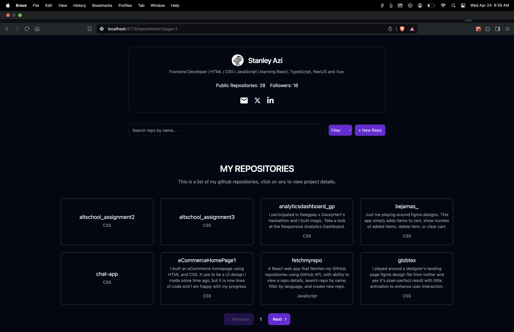
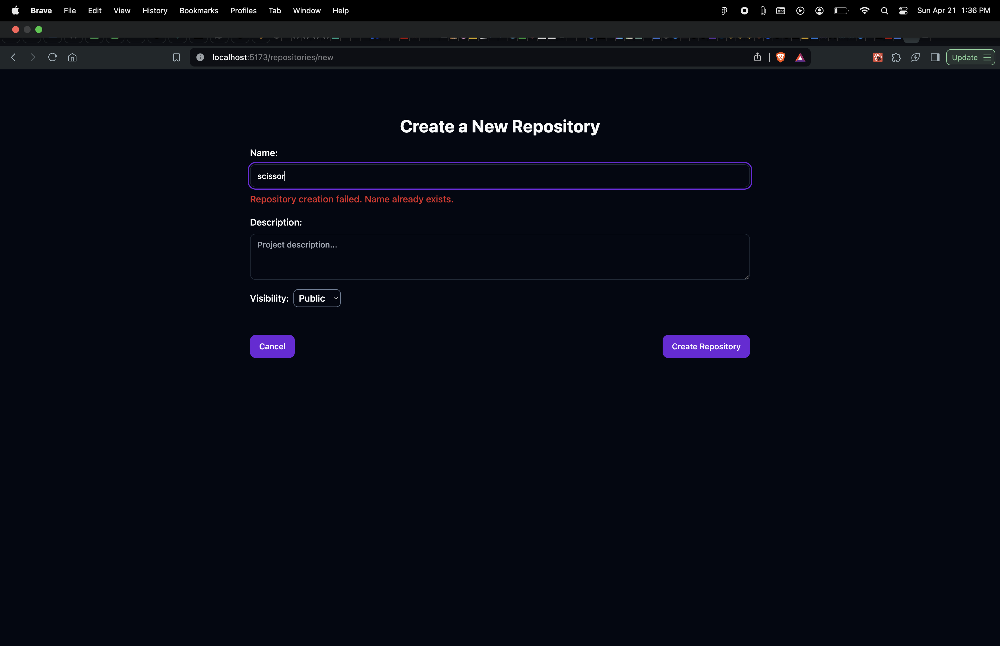
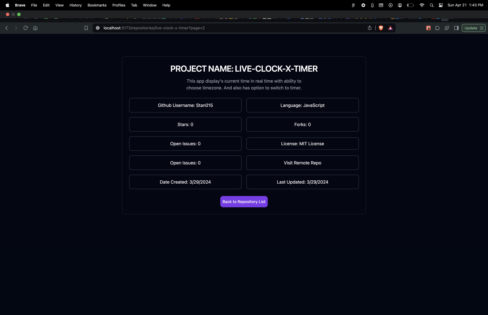
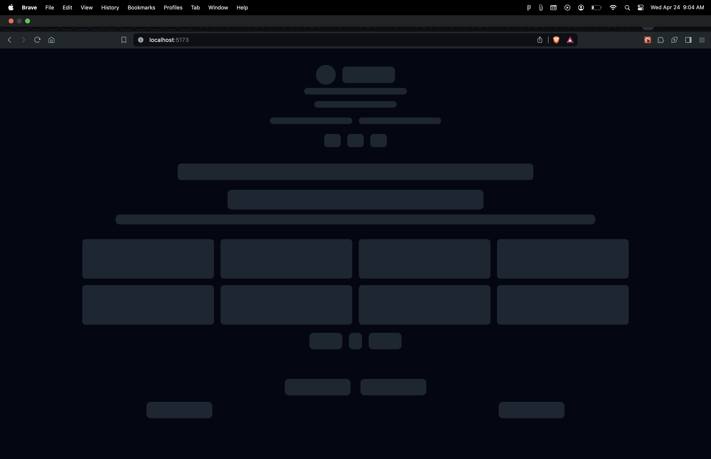

# AltSchool Second Semester Exam Project

## Project Name: Fetch My Repo app

### Questions

Implement a Web App using GitHub API to fetch your GitHub repositories portfolio

1. Show a page listing all your repositories on GitHub with pagination enabled. Bonus: Implement Search and Filter.
2. Create another page showing data for a single repo when clicked from the page. Show all repos using nested routes while using all the necessary tools in React.
3. Implement an Error Boundary (show a page to test the error boundary)
4. a 404 page  (show a page to test the 404 page).
5. Good Layout, UI, and Designs are essential. Accessibility techniques taught in semester one are Important.

BONUS: Provide a button to Create a new repo using a Modal, allow a way to update some details of the created repo, and finally add a way to delete the repo.

### My Approach for building this app

The project was started with Vite and all dependencies were installed with pnpm.

#### Technologies

- React
- Tailwindcss
- Shadcn UI

#### App features

- Ability to list all public github repositories
- Pagination was implemented
- Ability to click and view project/repository details
- Ability to nativigate back to the exact previous page after exploring repository details
- User card that displays user name, avatar, bio, etc.
- Ability to search by repository name accross all public repositories
- Ability to filter repositories by language
- Good looking UI
- Accessibility techniques applied
- 404 page was implemented in cases of not-found page (there is a button in footer to test 404 page)
- Error Boundary was implemented (there is a button in footer to test error boundary)
- Skeleton was implemented for all UIs
- head/meta data was implemented with react-helmet-async describing each page
- Ability to create new repository, validate inputs and display a message if name already exists.(Although I commented this out as this app is currently public and I wouldn't want random creation of repositories by people testing the app yet.)
- Routes implemented (ability to correctly show page number and project name in url) and more.

#### Some screenshots

